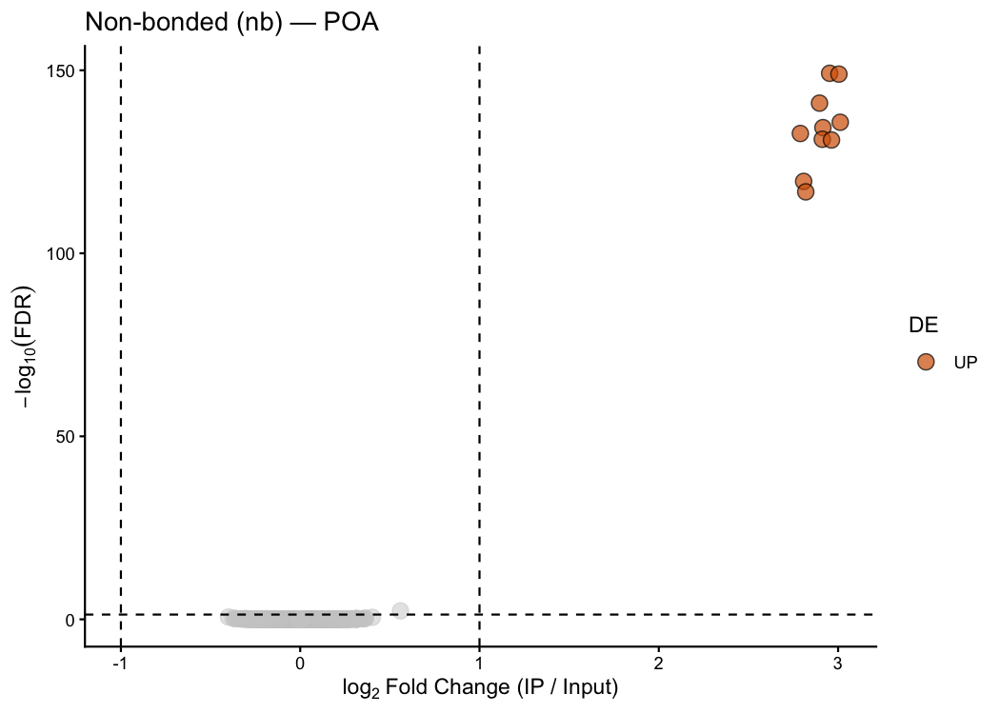
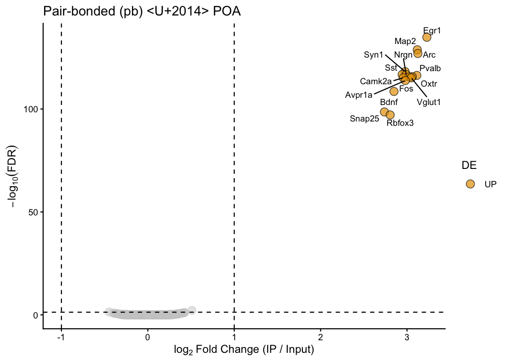
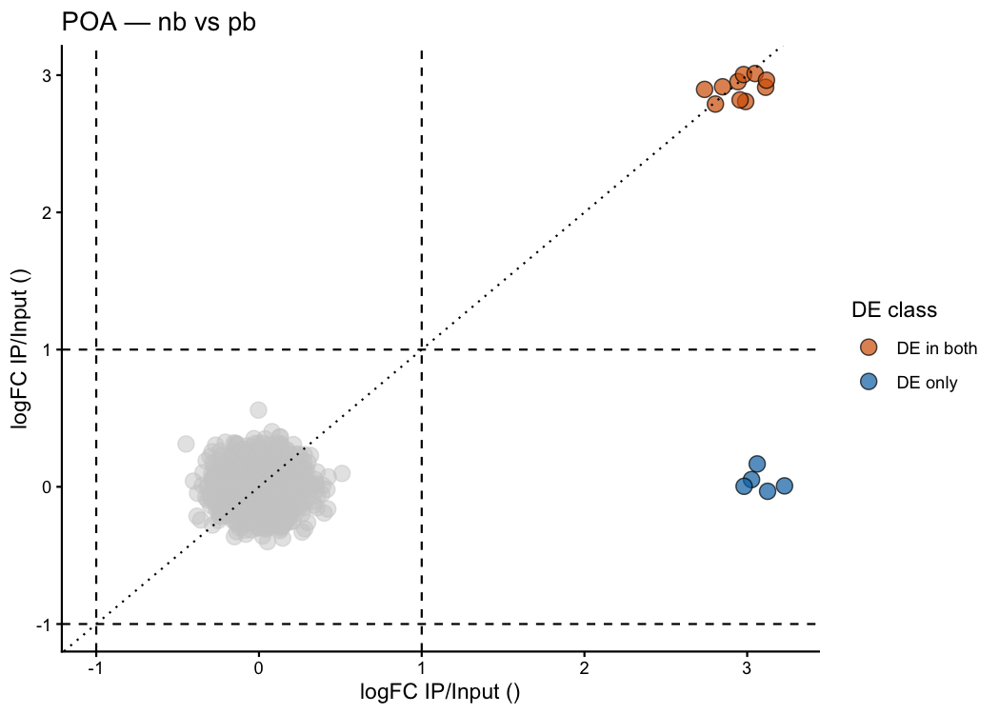
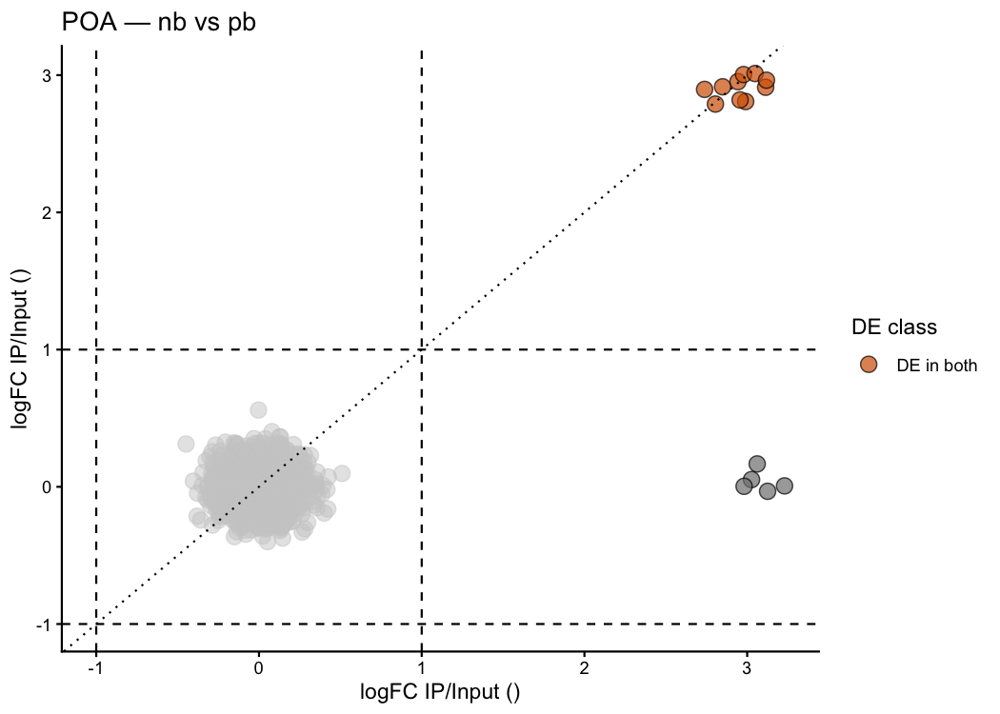

<!-- README.md is generated from README.Rmd. Please edit that file -->

# pTRAPPING 

<!-- badges: start -->

<!-- badges: end -->

**pTRAPPING** is an R package that provides a streamlined, reproducible
workflow for analysing **TRAP-seq** and **PhosphoTRAP** RNA-sequencing
data. It wraps the statistical power of
[edgeR](https://bioconductor.org/packages/edgeR/) and
[limma](https://bioconductor.org/packages/limma/) behind a compact set
of purpose-built functions that take you from a raw counts matrix to
publication-ready tables and figures in just a few lines of code.

> **What is TRAP-seq?** Translating Ribosome Affinity Purification
> followed by sequencing (TRAP-seq) captures mRNAs that are actively
> translated in a specific cell type, tagged by a transgenic ribosomal
> subunit. The key comparison is between the **IP fraction**
> (immunoprecipitated, actively translated transcripts) and the **INPUT
> fraction** (total RNA — all transcripts). Genes significantly enriched
> in IP relative to INPUT are translated in the tagged cell type.
>
> **PhosphoTRAP** adds an activity-marking phosphorylation step, so only
> *recently activated* neurons are captured — combining cell-type
> specificity with behavioural state information in a single experiment.

## Installation

``` r
# install.packages("devtools")
devtools::install_github("laurenoconnelllab/pTRAPPING")
```

## Functions at a glance

| Function | What it does |
|----|----|
| `ptrap_de()` | IP vs INPUT DE analysis for TRAP-seq (edgeR LRT/QLF or paired t-test) |
| `ptrap_volcano()` | Volcano plot from a single `ptrap_de()` result |
| `ptrap_volcano2()` | Dual scatter comparing two treatment conditions side by side |
| `limma_de()` | Multi-group DE for proteomics / metabolomics (limma `treat` or `eBayes`) |

------------------------------------------------------------------------

## Simulated dataset

Throughout this README we simulate a mouse TRAP-seq experiment studying
**pair-bonding** in the **preoptic area (POA)** of the hypothalamus — a
brain region well-known for its role in social behaviour.

Mice are divided into two groups:

- **`nb`** – non-bonded control mice
- **`pb`** – pair-bonded mice (48 h co-housing with a partner)

Each group has **3 animals** (biological replicates). Each animal
contributes one IP and one INPUT library, giving **12 samples** total.
The column-naming convention `<treatment><replicate><fraction>`
(e.g. `nb1INPUT`, `pb2IP`) lets `ptrap_de()` parse sample metadata
automatically — no `sample_df` needed.

``` r
library(pTRAPPING)
library(ggplot2)

set.seed(42)

n_genes  <- 2000
gene_ids <- paste0("Gene", seq_len(n_genes))

# ── Replace early positions with real mouse gene names ──────────────────────
# Neuronal markers — expected to be enriched in IP in BOTH groups
neuronal   <- c("Snap25", "Rbfox3", "Camk2a", "Vglut1", "Syn1",
                "Map2",   "Nrgn",   "Bdnf",   "Pvalb",  "Sst")
# Pair-bonding markers — enriched in IP only in pb
pb_markers <- c("Oxtr", "Avpr1a", "Fos", "Arc", "Egr1")
# Glial markers — NOT enriched in neuronal IP (control transcripts)
glial      <- c("Gfap", "Aldh1l1", "S100b", "Cx3cr1", "Tmem119")

gene_ids[seq_along(neuronal)]                                       <- neuronal
gene_ids[length(neuronal) + seq_along(pb_markers)]                  <- pb_markers
gene_ids[length(neuronal) + length(pb_markers) + seq_along(glial)]  <- glial

# ── True IP / INPUT enrichment ratios ───────────────────────────────────────
base_enrich        <- rep(1.0, n_genes)
base_enrich[1:10]  <- 8   # neuronal markers — constitutively enriched in both groups
base_enrich[11:15] <- 1   # pair-bonding markers — baseline (no enrichment in nb)

pb_extra           <- rep(1.0, n_genes)
pb_extra[11:15]    <- 8   # pair-bonding markers strongly enriched only in pb

# ── Helper: simulate one IP/INPUT pair for all genes ────────────────────────
sim_pair <- function(enrich, mu = 200, size = 10, sd_noise = 0.15) {
  input <- rnbinom(n_genes, mu = mu, size = size)
  ip    <- pmax(round(input * enrich * exp(rnorm(n_genes, 0, sd_noise))), 0L)
  list(input = input, ip = ip)
}

# ── Build counts data frame with auto-parseable column names ────────────────
cols <- lapply(1:3, function(i) {
  nb <- sim_pair(base_enrich)
  pb <- sim_pair(base_enrich * pb_extra)
  setNames(
    data.frame(nb$input, nb$ip, pb$input, pb$ip),
    c(paste0("nb", i, "INPUT"), paste0("nb", i, "IP"),
      paste0("pb", i, "INPUT"), paste0("pb", i, "IP"))
  )
})

counts_mat <- data.frame(Gene = gene_ids, do.call(cbind, cols))

# Preview — neuronal marker, pair-bonding marker, glial marker
counts_mat[c(1, 11, 16), 1:7]
#>      Gene nb1INPUT nb1IP pb1INPUT pb1IP nb2INPUT nb2IP
#> 1  Snap25      274  2231      150   910      229  1467
#> 11   Oxtr      217   260       83   630      290   333
#> 16   Gfap      151   117      143   123      222   307
```

The first column holds gene identifiers; the remaining 12 columns are
raw counts. `Snap25` (neuronal) already shows high IP counts in both
groups, while `Oxtr` (pair-bonding marker) shows balanced IP/INPUT — it
will only be enriched in `pb`.

------------------------------------------------------------------------

## `ptrap_de()` — differential expression

### Simplest call: auto-parse column names

When `sample_df` is omitted, `ptrap_de()` reads treatment, replicate
number, and fraction directly from the column names. Providing
`treatment_name` tells the function which group to analyse:

``` r
res_nb <- ptrap_de(
  counts_mat     = counts_mat,
  treatment_name = "nb",
  test_method    = "LRT"        # edgeR likelihood ratio test
)
#> Auto-parsed sample metadata from column names.
#>   Treatments : nb, pb
#>   Blocks     : 1, 2, 3
#>   Fractions  : INPUT, IP

# Top enriched genes in nb
head(res_nb[res_nb$diffexpressed != "NO",
            c("Gene", "logFC", "LR", "PValue", "FDR", "diffexpressed")])
#> # A tibble: 6 × 6
#>   Gene   logFC    LR    PValue       FDR diffexpressed
#>   <chr>  <dbl> <dbl>     <dbl>     <dbl> <chr>        
#> 1 Sst     2.95  695. 3.27e-153 6.54e-150 UP           
#> 2 Syn1    3.00  693. 1.10e-152 1.10e-149 UP           
#> 3 Snap25  2.90  656. 1.40e-144 9.31e-142 UP           
#> 4 Vglut1  3.01  631. 3.12e-139 1.56e-136 UP           
#> 5 Bdnf    2.92  624. 1.13e-137 4.50e-135 UP           
#> 6 Rbfox3  2.79  616. 5.50e-136 1.83e-133 UP
```

``` r
res_pb <- ptrap_de(
  counts_mat     = counts_mat,
  treatment_name = "pb",
  test_method    = "LRT"
)
#> Auto-parsed sample metadata from column names.
#>   Treatments : nb, pb
#>   Blocks     : 1, 2, 3
#>   Fractions  : INPUT, IP

# Top enriched genes in pb
head(res_pb[res_pb$diffexpressed != "NO",
            c("Gene", "logFC", "LR", "PValue", "FDR", "diffexpressed")])
#> # A tibble: 6 × 6
#>   Gene  logFC    LR    PValue       FDR diffexpressed
#>   <chr> <dbl> <dbl>     <dbl>     <dbl> <chr>        
#> 1 Egr1   3.23  629. 6.88e-139 1.38e-135 UP           
#> 2 Map2   3.12  600. 1.63e-132 1.63e-129 UP           
#> 3 Arc    3.13  591. 1.60e-130 1.07e-127 UP           
#> 4 Syn1   2.98  550. 1.36e-121 6.78e-119 UP           
#> 5 Sst    2.94  543. 4.18e-120 1.67e-117 UP           
#> 6 Nrgn   2.99  542. 5.61e-120 1.87e-117 UP
```

The neuronal markers (`Snap25`, `Camk2a`, etc.) are enriched in IP in
**both** groups. The pair-bonding markers (`Oxtr`, `Avpr1a`, `Fos`,
`Arc`, `Egr1`) only appear in the **pb** result — exactly as expected
for activity-dependent transcripts of pair-bonded neurons.

------------------------------------------------------------------------

### Choosing the right `test_method`

| Method | When to use |
|----|----|
| `"LRT"` | edgeR likelihood ratio test — recommended with ≥ 4 replicates and raw counts |
| `"QLF"` | edgeR quasi-likelihood F-test — more conservative, better FDR control |
| `"paired.ttest"` | Per-gene paired t-test (Tan et al. 2016) — recommended for n = 3 replicates typical of PhosphoTRAP |

``` r
# Quasi-likelihood F-test — more conservative than LRT
res_qlf <- ptrap_de(
  counts_mat     = counts_mat,
  treatment_name = "nb",
  test_method    = "QLF"
)

# Paired t-test — recommended for real PhosphoTRAP data with n = 3 animals
# Follows the approach in Tan et al. 2016 (Cell 167, 47-59)
res_pt <- ptrap_de(
  counts_mat     = counts_mat,
  treatment_name = "nb",
  test_method    = "paired.ttest"
)
```

> **Note on `"paired.ttest"`:** The GLM-based methods (`"LRT"` /
> `"QLF"`) estimate gene-wise dispersion from the data and work best
> with ≥ 4 replicates. With only n = 3, dispersion estimates are
> unreliable. The paired t-test avoids this by using only the
> within-gene variance across pairs, following Tan et al. (2016).

------------------------------------------------------------------------

### Long-format paired data with `return_long = TRUE`

`return_long = TRUE` (only with `"paired.ttest"`) returns the per-gene,
per-animal paired table used internally — useful for plotting individual
data points or performing additional quality checks:

``` r
res_long <- ptrap_de(
  counts_mat     = counts_mat,
  treatment_name = "nb",
  test_method    = "paired.ttest",
  return_long    = TRUE
)
#> Auto-parsed sample metadata from column names.
#>   Treatments : nb, pb
#>   Blocks     : 1, 2, 3
#>   Fractions  : INPUT, IP

# DE results tibble
head(res_long$results[, c("Gene", "logFC", "t_statistic", "PValue", "FDR")])
#> # A tibble: 6 × 5
#>   Gene      logFC t_statistic   PValue   FDR
#>   <chr>     <dbl>       <dbl>    <dbl> <dbl>
#> 1 Gene1833  0.144        65   0.000237 0.473
#> 2 Pvalb     2.91         39.4 0.000645 0.645
#> 3 Gene1001 -0.197       -27.6 0.00131  0.772
#> 4 Gene68    0.134        24.5 0.00166  0.772
#> 5 Gene248   0.221        19.7 0.00257  0.772
#> 6 Gene1529  0.211        19.0 0.00275  0.772

# Per-gene, per-animal paired counts table (showing Snap25)
res_long$long_data[res_long$long_data$Gene == "Snap25", ]
#> # A tibble: 3 × 4
#>   Gene   block ip_count input_count
#>   <chr>  <chr>    <dbl>       <dbl>
#> 1 Snap25 1         2231         274
#> 2 Snap25 2         1467         229
#> 3 Snap25 3         1398         177
```

------------------------------------------------------------------------

### Custom thresholds

Adjust `lfc_threshold` and `fdr_threshold` to control how strict the DE
classification is:

``` r
# Relaxed: any enrichment above 0.5 log2FC at FDR < 0.10
res_relaxed <- ptrap_de(
  counts_mat     = counts_mat,
  treatment_name = "pb",
  test_method    = "LRT",
  lfc_threshold  = 0.5,
  fdr_threshold  = 0.10
)
#> Auto-parsed sample metadata from column names.
#>   Treatments : nb, pb
#>   Blocks     : 1, 2, 3
#>   Fractions  : INPUT, IP

table(res_relaxed$diffexpressed)
#> 
#>   NO   UP 
#> 1984   16
```

------------------------------------------------------------------------

### HTML table with `kable.out = TRUE`

Set `kable.out = TRUE` to get a formatted HTML table of top genes —
ideal for Quarto / R Markdown reports:

``` r
ptrap_de(
  counts_mat     = counts_mat,
  treatment_name = "pb",
  test_method    = "LRT",
  kable.out      = TRUE,
  ngenes.out     = 10
)
```

------------------------------------------------------------------------

## `ptrap_volcano()` — single volcano plot

A classic volcano plot for one treatment condition, with significant
genes colour-coded and labelled:

``` r
ptrap_volcano(
  res_nb,
  title = "Non-bonded (nb) — POA"
)
```



Customise colours and thresholds:

``` r
ptrap_volcano(
  res_pb,
  lfc_threshold = 1,
  fdr_threshold = 0.05,
  colors        = c("UP" = "#E69F00", "DOWN" = "#56B4E9"),
  title         = "Pair-bonded (pb) — POA"
)
```



`Oxtr`, `Avpr1a`, `Fos`, `Arc`, and `Egr1` appear only in the pb plot —
consistent with their known roles in pair-bond formation and neuronal
immediate-early gene expression.

------------------------------------------------------------------------

## `ptrap_volcano2()` — dual scatter comparing two treatments

`ptrap_volcano2()` overlays both treatment conditions on a single
scatter plot. Each axis shows the log₂ fold-change (IP / INPUT) for one
group, and genes are colour-coded by their DE status across conditions:

``` r
ptrap_volcano2(
  res_nb, res_pb,
  treatment_col = "Treatment",
  title         = "POA — nb vs pb"
)
```



> **How to read this plot** \* **Top-right quadrant**: enriched in IP in
> **both groups** → constitutive neuronal translation (e.g. *Snap25*,
> *Camk2a*, *Rbfox3*). \* **Bottom-right**: enriched only in **pb** →
> activity-dependent translation in pair-bonded animals (*Oxtr*, *Fos*,
> *Arc*, *Egr1*, *Avpr1a*). \* **Top-left**: enriched only in **nb** →
> non-bonded-specific. \* The dotted diagonal is the identity line —
> equal enrichment in both groups.

Customise colours and thresholds:

``` r
ptrap_volcano2(
  res_nb, res_pb,
  lfc_threshold = 1,
  fdr_threshold = 0.05,
  treatment_col = "Treatment",
  title         = "POA — nb vs pb",
  colors        = c(
    "DE in both"   = "#D55E00",
    "DE only nb"   = "#0072B2",
    "DE only pb"   = "#009E73"
  )
)
```



------------------------------------------------------------------------

## `limma_de()` — proteomics and metabolomics

`limma_de()` wraps the limma linear modelling framework for **continuous
log-scale data** (label-free proteomics, metabolomics, or RNA-seq after
`voom`). Here we simulate a three-group proteomics experiment —
**control** (`ctrl`), **treatment A** (`trtA`), and **treatment B**
(`trtB`), with n = 6 replicates each.

``` r
set.seed(123)

n_prot <- 1000
n_rep  <- 6
groups <- factor(rep(c("ctrl", "trtA", "trtB"), each = n_rep))

# log2 protein abundances drawn from a normal background
prot_mat <- matrix(
  rnorm(n_prot * length(groups), mean = 10, sd = 0.4),
  nrow     = n_prot,
  dimnames = list(
    paste0("Prot", seq_len(n_prot)),
    paste0(rep(c("ctrl", "trtA", "trtB"), each = n_rep),
           "_", seq_len(length(groups)))
  )
)

# Inject true biological differences
prot_mat[1:60,    groups == "trtA"]               <- prot_mat[1:60,    groups == "trtA"]               + 2
prot_mat[61:120,  groups == "trtB"]               <- prot_mat[61:120,  groups == "trtB"]               - 2
prot_mat[121:150, groups %in% c("trtA", "trtB")]  <- prot_mat[121:150, groups %in% c("trtA", "trtB")]  + 2
```

> **Tip — contrast string naming convention:** Inside `limma_de()`, the
> design matrix is built as `model.matrix(~ 0 + group)` (pairwise) or
> `model.matrix(~ group)` (reference), where the variable is always
> called `group`. Coefficient names therefore follow the pattern
> `group<level>` (e.g. `groupctrl`, `grouptrtA`). Pass contrast strings
> using these names.

### Pairwise design with `eBayes()` (standard empirical Bayes)

``` r
library(limma)

res_prot <- limma_de(
  expr_mat      = prot_mat,
  group         = groups,
  contrast_mat  = c(trtA_vs_ctrl = "grouptrtA - groupctrl",
                    trtB_vs_ctrl = "grouptrtB - groupctrl"),
  test_method   = "eBayes",
  lfc_threshold = 1,
  fdr_threshold = 0.05
)

# Number of DE proteins per contrast
sapply(res_prot$de_list, nrow)
#> trtA_vs_ctrl trtB_vs_ctrl 
#>           90           90
```

``` r
# Proteins DE in opposite directions across contrasts (worth investigating!)
res_prot$shared
#> # A tibble: 0 × 4
#> # ℹ 4 variables: feature <chr>, min_fc <dbl>, max_fc <dbl>, n_contrasts <int>

# Consistently DE proteins, counted by direction
res_prot$unique
#> # A tibble: 2 × 2
#>   direction n_features
#>   <chr>          <int>
#> 1 DOWN              60
#> 2 UP                90
```

Each element of `$de_list` is a tibble for one contrast:

``` r
head(res_prot$de_list[["trtA_vs_ctrl"]])
#> # A tibble: 6 × 9
#>   feature logFC AveExpr     t  P.Value adj.P.Val     B contrast    diffexpressed
#>   <chr>   <dbl>   <dbl> <dbl>    <dbl>     <dbl> <dbl> <chr>       <chr>        
#> 1 Prot25   2.57    10.6  11.2 3.37e-25  3.37e-22  46.5 trtA_vs_ct… UP           
#> 2 Prot48   2.51    10.6  11.0 1.22e-24  6.11e-22  45.2 trtA_vs_ct… UP           
#> 3 Prot22   2.47    10.6  10.8 9.22e-24  3.07e-21  43.2 trtA_vs_ct… UP           
#> 4 Prot38   2.45    10.7  10.6 3.23e-23  8.07e-21  42.0 trtA_vs_ct… UP           
#> 5 Prot46   2.39    10.6  10.5 6.09e-23  1.03e-20  41.4 trtA_vs_ct… UP           
#> 6 Prot13   2.42    10.7  10.5 6.19e-23  1.03e-20  41.3 trtA_vs_ct… UP
```

### Pairwise design with `treat()` (minimum fold-change test)

`treat()` tests whether \|logFC\| *exceeds* `lfc_threshold`, providing
stronger protection against proteins with statistical but not biological
significance. Recommended when biological effect sizes are well-defined
(e.g. proteomics):

``` r
res_prot_tr <- limma_de(
  expr_mat      = prot_mat,
  group         = groups,
  contrast_mat  = c(trtA_vs_ctrl = "grouptrtA - groupctrl",
                    trtB_vs_ctrl = "grouptrtB - groupctrl"),
  test_method   = "treat",
  lfc_threshold = 1,
  fdr_threshold = 0.05
)

sapply(res_prot_tr$de_list, nrow)
#> trtA_vs_ctrl trtB_vs_ctrl 
#>           86           87
```

### Reference-group design

When all comparisons are against a single baseline,
`model_type = "reference"` is a simpler alternative — the first factor
level becomes the reference and other coefficients are differences from
it:

``` r
res_prot_ref <- limma_de(
  expr_mat      = prot_mat,
  group         = as.character(groups),
  contrast_mat  = c("grouptrtA", "grouptrtB"),   # coefficient names in ~ group
  model_type    = "reference",
  test_method   = "eBayes",
  lfc_threshold = 1,
  fdr_threshold = 0.05
)
#> Renaming (Intercept) to Intercept

sapply(res_prot_ref$de_list, nrow)
#> grouptrtA grouptrtB 
#>        90        90
```

### HTML table with `kable_out = TRUE`

``` r
limma_de(
  expr_mat      = prot_mat,
  group         = groups,
  contrast_mat  = c(trtA_vs_ctrl = "grouptrtA - groupctrl",
                    trtB_vs_ctrl = "grouptrtB - groupctrl"),
  test_method   = "eBayes",
  lfc_threshold = 1,
  kable_out     = TRUE,
  ngenes_out    = 10,
  kable_coef    = 1      # display: trtA vs ctrl
)
```

------------------------------------------------------------------------

## Providing sample metadata explicitly

For more complex designs — multiple brain regions, custom blocking
variables, or non-standard column naming — supply `sample_df` directly:

``` r
# Example: two brain regions, two treatments
sample_df <- data.frame(
  sample    = c("POA_nb1_IP", "POA_nb1_INPUT", "POA_pb1_IP", "POA_pb1_INPUT",
                "AMY_nb1_IP", "AMY_nb1_INPUT", "AMY_pb1_IP", "AMY_pb1_INPUT"),
  region    = rep(c("POA", "AMY"), each = 4),
  treatment = rep(c("nb", "nb", "pb", "pb"), 2),
  block     = rep("1", 8),
  fraction  = rep(c("IP", "INPUT", "IP", "INPUT"), 2)
)

res_poa_pb <- ptrap_de(
  counts_mat     = my_counts,
  sample_df      = sample_df,
  gene_ids       = my_gene_ids,
  region_name    = "POA",
  treatment_name = "pb",
  region_col     = "region",
  treatment_col  = "treatment",
  block_col      = "block",
  fraction_col   = "fraction",
  test_method    = "paired.ttest"
)
```

------------------------------------------------------------------------

## Citation

If you use **pTRAPPING** in your research, please cite:

> Rodríguez, C. (2024). *pTRAPPING: A Suite of Functions for the
> Analyses of PhosphoTRAP Data in R*.
> <https://github.com/laurenoconnelllab/pTRAPPING>

For the paired t-test method (`test_method = "paired.ttest"`):

> Tan, C.L., Cooke, E.K., Leib, D.E., Lin, Y.C., Daly, G.E., Zimmerman,
> C.A., and Knight, Z.A. (2016). Warm-Sensitive Neurons that Control
> Body Temperature. *Cell* 167, 47–59.
> <https://doi.org/10.1016/j.cell.2016.08.028>
