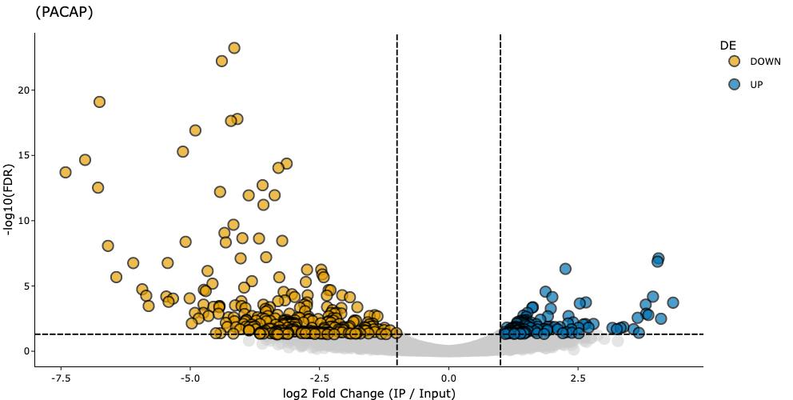

<!-- README.md is generated from README.Rmd. Please edit that file -->

# pTRAPPING 

<!-- badges: start -->

<!-- badges: end -->

**pTRAPPING** takes the raw count data from a TRAP-seq or PhosphoTRAP
experiment and finds which genes are specifically enriched in your cell
population of interest — all in a few lines of R. You give it a counts
table where every sample column is labelled with its treatment group,
replicate number, and whether it is IP (immunoprecipitated) or INPUT
(total RNA); the package figures out the rest. Three functions cover the
full workflow: differential expression with your choice of statistical
engine (`ptrap_de()`), a classic volcano plot for one condition
(`ptrap_volcano()`), and a paired scatter plot to compare two conditions
head-to-head (`ptrap_volcano2()`).

## Installation

``` r
# install.packages("devtools")
devtools::install_github("laurenoconnelllab/pTRAPPING")
```

Dependencies from Bioconductor (edgeR, limma, DESeq2) are installed
automatically.

## Functions at a glance

| Function | What it does |
|----|----|
| `ptrap_de()` | Differential expression: IP vs INPUT. Six statistical methods. |
| `ptrap_volcano()` | Volcano plot for a single condition. |
| `ptrap_volcano2()` | Scatter plot comparing two conditions side-by-side. |

## Quick start

Get differential expression results of interesting genes from your
counts matrix in just a few lines of code:

``` r
library(pTRAPPING)

# Load counts matrix
counts.mat <- read.delim(
  system.file("extdata", "TAN_etal_2016_raw.txt", package = "pTRAPPING")
)

# Table of differentially expressed genes of interest for one condition using the default method "LRT" from edgeR
ptrap_de(
  counts_mat = counts.mat,
  treatment_name = "PACAP",
  kable.out = TRUE,
  genes.filter = c(
    "Adcyap1",
    "Bdnf",
    "Ucn3",
    "Gng8",
    "Fosl2",
    "Junb",
    "Trappc12",
    "Gfap"
  )
)
```

<table data-quarto-disable-processing="true" class=" lightable-classic" style="font-family: Cambria; width: auto !important; margin-left: auto; margin-right: auto;">

<thead>

<tr>

<th style="text-align:left;font-weight: bold;font-style: italic;">

Gene
</th>

<th style="text-align:right;font-weight: bold;font-style: italic;">

logFC
</th>

<th style="text-align:right;font-weight: bold;font-style: italic;">

logCPM
</th>

<th style="text-align:right;font-weight: bold;font-style: italic;">

LR
</th>

<th style="text-align:left;font-weight: bold;font-style: italic;">

PValue
</th>

<th style="text-align:left;font-weight: bold;font-style: italic;">

FDR
</th>

<th style="text-align:left;font-weight: bold;font-style: italic;">

treatment
</th>

<th style="text-align:left;font-weight: bold;font-style: italic;">

diffexpressed
</th>

</tr>

</thead>

<tbody>

<tr>

<td style="text-align:left;font-weight: bold;">

Gng8
</td>

<td style="text-align:right;">

4.056
</td>

<td style="text-align:right;">

5.578
</td>

<td style="text-align:right;">

39.952
</td>

<td style="text-align:left;">

\<0.001
</td>

<td style="text-align:left;">

\<0.001
</td>

<td style="text-align:left;">

PACAP
</td>

<td style="text-align:left;">

UP
</td>

</tr>

<tr>

<td style="text-align:left;font-weight: bold;">

Ucn3
</td>

<td style="text-align:right;">

3.949
</td>

<td style="text-align:right;">

5.218
</td>

<td style="text-align:right;">

25.454
</td>

<td style="text-align:left;">

\<0.001
</td>

<td style="text-align:left;">

\<0.001
</td>

<td style="text-align:left;">

PACAP
</td>

<td style="text-align:left;">

UP
</td>

</tr>

<tr>

<td style="text-align:left;font-weight: bold;">

Bdnf
</td>

<td style="text-align:right;">

4.338
</td>

<td style="text-align:right;">

3.090
</td>

<td style="text-align:right;">

23.035
</td>

<td style="text-align:left;">

\<0.001
</td>

<td style="text-align:left;">

\<0.001
</td>

<td style="text-align:left;">

PACAP
</td>

<td style="text-align:left;">

UP
</td>

</tr>

<tr>

<td style="text-align:left;font-weight: bold;">

Trappc12
</td>

<td style="text-align:right;">

-3.345
</td>

<td style="text-align:right;">

1.809
</td>

<td style="text-align:right;">

10.679
</td>

<td style="text-align:left;">

0.001
</td>

<td style="text-align:left;">

0.030
</td>

<td style="text-align:left;">

PACAP
</td>

<td style="text-align:left;">

DOWN
</td>

</tr>

<tr>

<td style="text-align:left;font-weight: bold;">

Gfap
</td>

<td style="text-align:right;">

-2.979
</td>

<td style="text-align:right;">

5.086
</td>

<td style="text-align:right;">

10.628
</td>

<td style="text-align:left;">

0.001
</td>

<td style="text-align:left;">

0.031
</td>

<td style="text-align:left;">

PACAP
</td>

<td style="text-align:left;">

DOWN
</td>

</tr>

<tr>

<td style="text-align:left;font-weight: bold;">

Fosl2
</td>

<td style="text-align:right;">

0.781
</td>

<td style="text-align:right;">

6.990
</td>

<td style="text-align:right;">

3.694
</td>

<td style="text-align:left;">

0.055
</td>

<td style="text-align:left;">

0.304
</td>

<td style="text-align:left;">

PACAP
</td>

<td style="text-align:left;">

NO
</td>

</tr>

<tr>

<td style="text-align:left;font-weight: bold;">

Adcyap1
</td>

<td style="text-align:right;">

1.516
</td>

<td style="text-align:right;">

3.665
</td>

<td style="text-align:right;">

2.708
</td>

<td style="text-align:left;">

0.100
</td>

<td style="text-align:left;">

0.398
</td>

<td style="text-align:left;">

PACAP
</td>

<td style="text-align:left;">

NO
</td>

</tr>

<tr>

<td style="text-align:left;font-weight: bold;">

Junb
</td>

<td style="text-align:right;">

0.757
</td>

<td style="text-align:right;">

4.568
</td>

<td style="text-align:right;">

1.385
</td>

<td style="text-align:left;">

0.239
</td>

<td style="text-align:left;">

0.600
</td>

<td style="text-align:left;">

PACAP
</td>

<td style="text-align:left;">

NO
</td>

</tr>

</tbody>

</table>

Plot the same results in an interactive volcano plot and hover over the
points to see gene labels, logFC, p-value, and FDR:

``` r
# Volcano plot — label a few genes of interest
ptrap_de(
  counts_mat = counts.mat,
  treatment_name = "PACAP"
) |>
  ptrap_volcano(
    interactive = TRUE
  )
```



## Learn more

- **Full walkthrough:** [Getting started with
  pTRAPPING](https://laurenoconnelllab.github.io/pTRAPPING/articles/getting-started.html)

- The example dataset is from:

> Tan, C.L., Cooke, E.K., Leib, D.E., Lin, Y.-C., Daly, G.E., Zimmerman,
> C.A., and Knight, Z.A. (2016). Warm-sensitive neurons that control
> body temperature. *Cell* 167, 47–59.
> <https://doi.org/10.1016/j.cell.2016.08.028>

- The PhosphoTRAP method was introduced in:

> Knight, Z.A., Tan, K., Birsoy, K., Schmidt, S., Garrison, J.L.,
> Wysocki, R.W., Emiliano, A., Ekstrand, M.I., and Friedman, J.M.
> (2012). Molecular profiling of activated neurons by phosphorylated
> ribosome capture. *Cell* 151, 1126–1137.
> <https://doi.org/10.1016/j.cell.2012.10.039>
